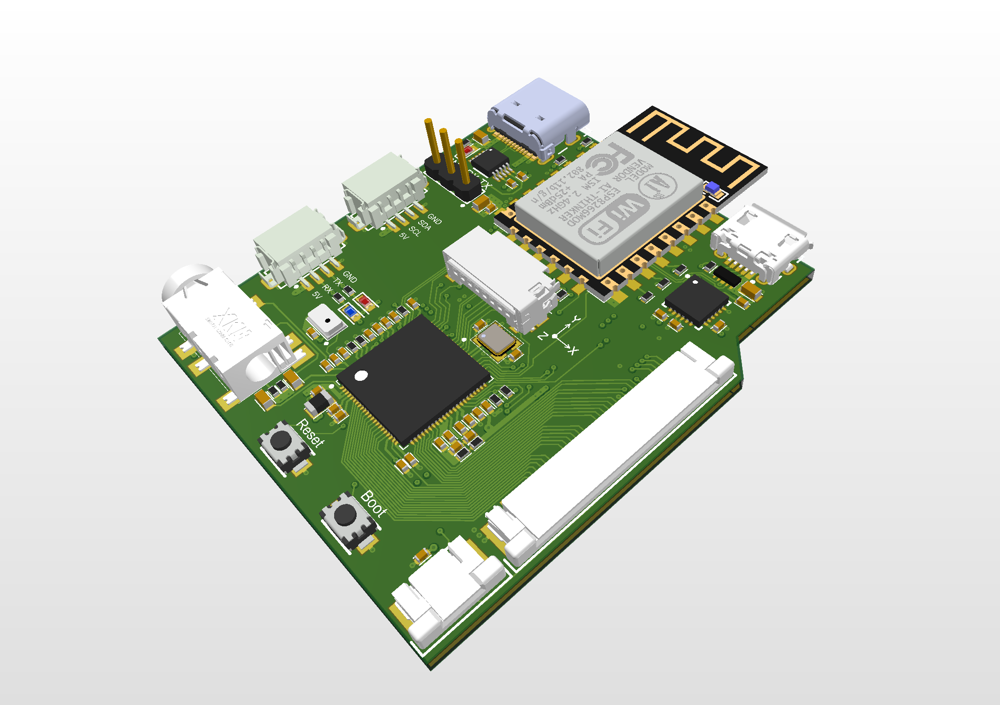

# AllWinner F1C200S - Card size embedded board
> This project is aiming to build the whole embedded board from scratch. From designing PCB to bring-up and program.
-  The board spec:
   -  CPU: Allwinner F1C200S with 64MB RAM
   -  ESP8266 as WiFi adapter
   -  3.5mm audio output
   -  16MB Nor-Flash
   -  24 bit LCD with touch support
   -  6 axis sensor
   -  I2C and UART IO port
   -  MicroSD card

## 1. **HARDWARE**

- The F1C200S is SoC with ARM 9 CPU and 64MB SIP memory. As it only has one SDIO peripheral and already spend for SD card, I use ESP8266 as Wifi adapter through SPI bus, details can be found here https://www.cnblogs.com/twzy/p/15160808.html
- MPU6050 as 6-axis sensor, suitable for testing as well as a cool feature for applications.
- 16MB Nor-Flash, you can store the OS on Nor-flash and boot it directly without an SD card.
- 24 bit general LCD, suitable for UI applications.
- 3.5mm audio output, play everything you want!

#### The board has been designed and ready for fabricating.

## 2. **LINUX**
   Updating...
## 3. **SOFTWARE**
   Updating...
